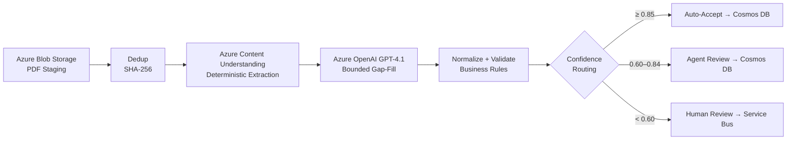

# Modernizing Document Intelligence with AI-Driven Hybrid Extraction

In document-intensive industries—construction, insurance, legal, healthcare, finance—organizations process thousands of complex multi-page documents daily. Architectural drawings, insurance claims, engineering specifications, and legal contracts contain critical structured data buried in tables, annotations, diagrams, and free-form text.

While AI has dramatically improved document understanding capabilities, the extraction of structured data from complex documents remains a significant challenge. Documents vary in layout, quality, and complexity. Engineers and analysts frequently review extraction results manually, making the process labor-intensive, inconsistent, difficult to scale, and often reactive rather than predictive.

Environmental factors such as scan quality, multi-page layouts, overlapping information sections, inconsistent formatting, and domain-specific terminology further complicate automation.

This creates a clear opportunity for transformation through AI. By combining deterministic document understanding models with Generative AI reasoning capabilities, organizations can move beyond manual review toward scalable, intelligent extraction systems. Deterministic models provide precise field detection with confidence scores, while Generative AI enhances interpretation, validates ambiguous values, and fills extraction gaps—together enabling more robust data capture and operational insight.

This article presents a validated architecture and practical lessons learned from implementing an AI-driven document extraction solution. While architectural/engineering document extraction serves as a representative example, the architecture and approach apply broadly across any domain requiring structured data extraction from complex documents.

> **Full reference implementation**: The complete working codebase (Python + Bicep) is available at [GitHub: document-extraction-pipeline](https://github.com/your-org/document-extraction-pipeline) — clone it, swap your schema, and deploy.

## The Evolution from GenAI Approach to Deterministic Precision

Starting with a Generative AI–driven approach to extract structured fields from documents is a fundamentally more effective initial strategy. It accelerates early-stage extraction without requiring large labeled datasets, while simultaneously enabling structured data collection needed to train deterministic models—which typically require thousands of annotated samples.

This approach delivers immediate value by rapidly identifying relevant data patterns in documents and uncovering key factors that influence extraction accuracy, such as document quality, layout complexity, and multi-section ambiguity. At the same time, it naturally builds the dataset necessary to transition toward a more scalable and repeatable solution.

However, it also makes clear that while Generative AI is powerful for contextual reasoning across document sections, it is inherently non-deterministic and sensitive to input variability. For enterprise-grade reliability, precision, and repeatability, a complementary approach is required.

The optimal solution is a hybrid model that combines the strengths of both:

- **Azure Content Understanding** (deterministic) provides precise, consistent field extraction with per-field confidence scores at scale.
- **Azure OpenAI GPT-4.1** (generative) adds contextual reasoning, validates ambiguous fields, fills extraction gaps, and interprets complex multi-section relationships.
- **AI Agent** (bounded triage) handles exception cases with structured CORRECT/ACCEPT/ESCALATE decisions before human escalation.

Together, they form a superior system—delivering higher accuracy, reduced ambiguity, bounded AI cost, and stronger auditability in complex real-world conditions.

> AI cannot compensate for inconsistent input data. Standardized document schemas and operational discipline remain prerequisites for reliable automation.

## Solution Components and Architecture

The solution follows a modular, event-driven architecture that combines deterministic document understanding and Generative AI to enable scalable, intelligent extraction workflows. At a high level, documents are ingested, deduplicated, processed through Azure Content Understanding for primary extraction, enhanced with GPT-4.1 for gap-fill verification, validated against business rules, and routed through a confidence-based decision system before persistence.



The pipeline execution follows this flow: a document is uploaded to Azure Blob Storage, triggering the orchestrator. The pipeline checks for duplicates via SHA-256 hash against Cosmos DB. New documents are submitted to Azure Content Understanding, which returns structured fields with per-field confidence scores. The AI Schema Mapper then identifies gaps—fields that are missing or have confidence below 0.70—and sends only those to GPT-4.1 for verification. Results are normalized, validated against cross-field business rules, and routed based on aggregate confidence.

Throughout the pipeline, built-in feedback loops—quality filtering, validation checks, and confidence gates—ensure that only high-confidence results are persisted automatically, enabling a reliable and production-ready extraction system.

**Azure Blob Storage** — Primary storage for source PDFs and extraction artifacts. Standard_LRS, Hot tier, HTTPS-only with SAS-secured access for Content Understanding.

**Azure Content Understanding (S0)** — Primary deterministic extractor with custom analyzer supporting 100+ configurable fields. Returns per-field confidence scores (0.0–1.0) plus raw markdown text. Non-LLM, repeatable, and auditable.

**Azure AI Foundry / OpenAI (GPT-4.1)** — Bounded gap-fill verifier invoked only for missing or low-confidence fields (typically 10–20% of total). Temperature 0.0, JSON response format enforced, schema-aware prompting with domain rules.

**Azure Cosmos DB (Serverless)** — Document persistence with SHA-256 deduplication, version increment on re-processing, and partition-by-document-type for efficient querying. Pay-per-request scales from zero.

**Azure Service Bus (Basic)** — Event-driven queue integration with `document-processing` and `human-review` queues for processing triggers and escalation routing.

**Application Insights + OpenTelemetry** — End-to-end observability with per-stage telemetry events, custom metrics (fill_rate, record_confidence, extraction_duration_ms), and distributed tracing.

### Core Code Pattern: Confidence-Based Routing

The routing decision—the architectural centerpiece—determines whether a document is auto-accepted, triaged by an AI agent, or escalated to humans:

```python
def _routing_decision(self, extraction: ExtractionResult) -> ReviewDecision:
    confidence = extraction.record_confidence
    low_fields = extraction.low_confidence_fields

    if confidence >= 0.85 and not low_fields:
        return ReviewDecision.AUTO_ACCEPT      # ~60-70% of documents

    if confidence >= 0.60 and low_fields:
        return ReviewDecision.AGENT_REVIEW     # ~20-25% of documents

    return ReviewDecision.HUMAN_REVIEW          # ~10-15% of documents
```

### Core Code Pattern: Bounded AI Gap-Fill

The AI mapper preserves high-confidence CU values and only fills gaps—this is the key to bounded cost:

```python
def fill_gaps(self, extraction: ExtractionResult, raw_text: str) -> ExtractionResult:
    gap_fields = self._identify_gaps(extraction)  # Only missing or confidence < 0.70
    if not gap_fields:
        return extraction  # No LLM call needed — saves cost

    extracted = self._call_model(gap_fields, raw_text, extraction)

    for dot_path, value in extracted.items():
        if value is None:
            continue
        existing = extraction.fields.get(dot_path)
        # CRITICAL: Never overwrite high-confidence CU values
        if existing and existing.confidence and existing.confidence >= 0.70:
            continue
        extraction.fields[dot_path] = FieldResult(
            field_path=dot_path, value=value,
            confidence=0.65, source="ai_mapper", status="filled",
        )
    return extraction
```

### Cost Impact of Hybrid Approach

| Metric | CU-Only | GPT-Only | Hybrid (This Architecture) |
|--------|---------|----------|--------|
| Cost per document | ~$0.01 | $0.15–0.30 | $0.03–0.05 |
| Determinism | 100% | Variable | 95%+ |
| Accuracy | 75–85% | 80–90% | 90–95% |
| Auditability | Full | Limited | Per-field source attribution |

**Cost savings: 60–80% reduction** compared to GPT-only by limiting LLM to gap fields.

## Security and Enterprise Considerations

**Azure Blob Storage**: Secured via Private Endpoints with public access disabled, Microsoft Entra ID authentication (no shared keys), least-privilege RBAC with managed identities, encryption in transit (TLS 1.2+) and at rest using Microsoft-managed or customer-managed keys in Key Vault, with Microsoft Defender for Storage and Azure Policy enabled for threat detection and compliance.

**Azure Content Understanding / AI Vision**: Enterprise-grade security through Entra ID–based authentication and RBAC. Network isolation via VNet integration and Private Link. All data encrypted in transit (TLS 1.2+) and at rest with optional CMKs. Microsoft Defender for Cloud provides security posture visibility across AI workloads.

**Azure OpenAI (GPT-4.1)**: Governed model access with strong identity, network, encryption, and logging controls. Layered defenses including content filtering, safety meta-prompts, and least-privilege permissions. Temperature 0.0 + JSON response format reduces prompt injection surface. Human-in-the-loop via confidence routing prevents autonomous execution of incorrect outcomes. Continuous monitoring for misuse and anomalous behavior.

**Azure Cosmos DB**: Network security via VNet integration and Private Link. Data protection through Microsoft Purview integration for classification and Defender for Cosmos DB for threat detection. All data encrypted in transit (TLS 1.2+ mandatory) and at rest with Microsoft-managed or customer-managed keys.

**Azure Functions / Compute**: Secured with Entra ID authentication and managed identities, least-privilege RBAC, HTTPS-only access, private endpoints, VNet integration, and Key Vault for secrets. Hardened with Azure Policy, Defender for Cloud, and centralized logging.

**Microsoft Foundry**: RBAC via Microsoft Entra ID with Managed Identities and Conditional Access. Private Link, Managed Network Isolation, and NSGs for resource access restriction. Azure Policy for configuration auditing. Entra Agent ID extends identity management to AI agents. AI Security Posture Management and Defender for AI Services provide threat protection.

**DevOps Security**: Threat modeling with Microsoft Threat Modeling Tool, SBOM maintenance, and security shifted left into CI/CD. GitHub Advanced Security for dependency scanning, CodeQL SAST, and secret scanning. Infrastructure-as-code validated with Azure Policy and Defender for Cloud. Key Vault for secrets, Managed Identities for least-privilege, and Defender for Cloud DevOps Security for code-to-cloud visibility.

## Related and Future Scenarios

Although document extraction serves as the initial use case, this architecture establishes a scalable pattern for many applications:

- **Insurance Claims Processing**: Swap schema to claim fields; update CU analyzer for claim forms
- **Legal Contract Analysis**: Schema for clauses, parties, dates; add NER in normalization
- **Healthcare Medical Records**: HIPAA-compliant Cosmos; schema for diagnoses, medications, vitals
- **Financial Document Processing**: Schema for transactions, accounts; add currency normalization
- **Engineering/Construction Plans**: Schema for dimensions, materials, specifications
- **Digital Twin Integration**: Feed extracted data into asset models for real-time facility visualization
- **Predictive Analytics**: Track extracted values over time for trend detection and forecasting

## Conclusion

Modernizing document extraction is not simply about applying AI—it requires aligning technology, operational discipline, and data quality. Early exploration using Generative AI enabled rapid learning and feasibility validation. However, a production-grade solution must be built on deterministic document understanding models supported by standardized schema definitions and operational controls.

By combining Azure Content Understanding for deterministic primary extraction, Azure OpenAI for bounded gap-fill verification, and confidence-based routing for intelligent human-in-the-loop decisions, organizations can achieve scalable, repeatable, and auditable extraction processes. This hybrid approach enables reduced manual effort, lower error rates, and the transition from batch manual processing to intelligent automated workflows.

The result is not just an automated extraction tool, but a scalable AI architecture for modern document intelligence—adaptable to any industry, any document type, and any structured data need.

> **Get started**: Clone the [full reference implementation](https://github.com/your-org/document-extraction-pipeline) with working Python code, Bicep infrastructure templates, configurable schemas, and detailed setup instructions.

---

**Contributors:**
This article is maintained by Microsoft. It was originally written by the following contributors.
